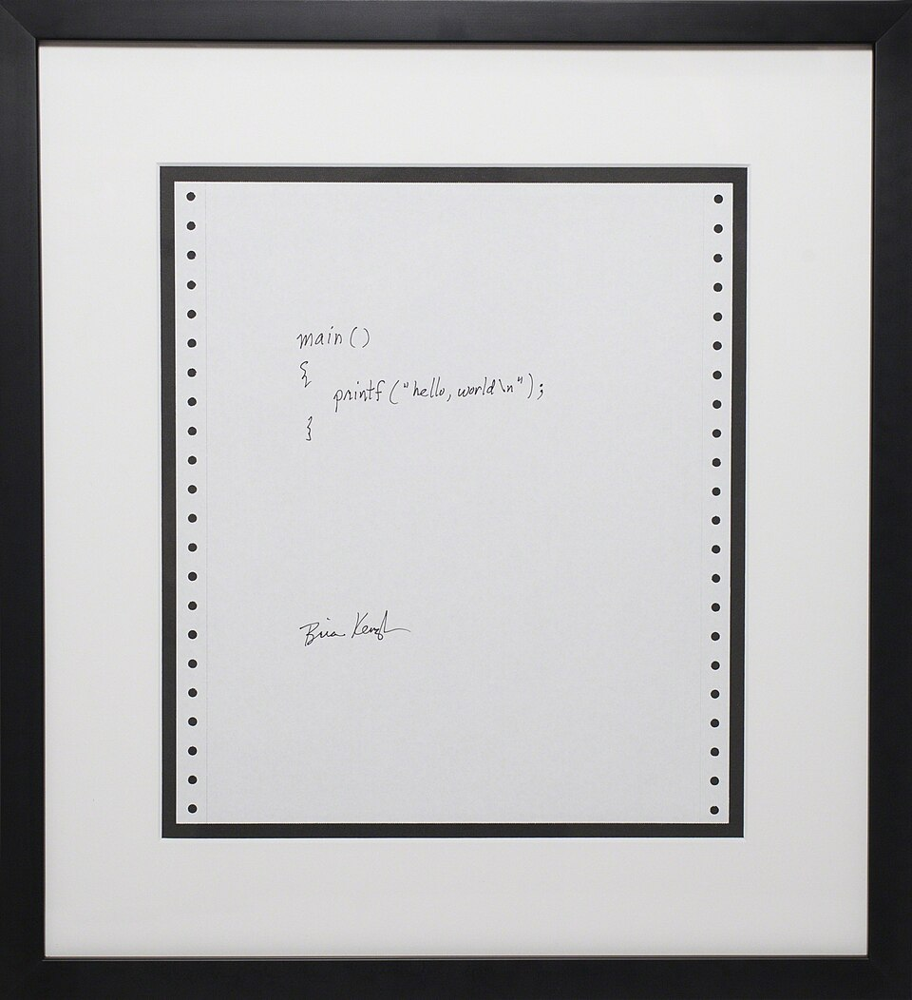

<!-- Placeholder text: adapted from Wikipedia's "Hello, world" article
     (CC BY-SA 4.0), https://en.wikipedia.org/wiki/Hello,_world
     Image by Brian Kernighan, CC BY-SA 3.0, via Wikimedia Commons. -->

A "**Hello, world**" program is usually a simple computer program that outputs a message similar to "Hello, world". The text may be printed out or displayed on a screen (often a console). A small piece of code in most general-purpose programming languages, this program is used to illustrate a language's basic syntax. Such a program is often the first written by a student of a new programming language,[^langbridge] but it can also be used as a sanity check to ensure that the computer software intended to compile or run source code is correctly installed, and that its operator understands how to use it.

## History



While several small test programs have existed since the development of programmable computers, the tradition of using the phrase "Hello, world" as a test message was influenced by an example program in the 1978 book *The C Programming Language*,[^kr] with likely earlier use in BCPL. The example program from the book prints `"hello, world"`, and was inherited from a 1974 Bell Laboratories internal memorandum by Brian Kernighan, *Programming in C: A Tutorial*:[^ctut]

```c
main( ) {
        printf("hello, world");
}
```

In the above example, the `main( )` function defines where the program should start executing. The function body consists of a single statement, a call to the `printf()` function, which stands for "*print f*ormatted"; it outputs to the console whatever is passed to it as the parameter, in this case the string `"hello, world"`.

The C-language version was preceded by Kernighan's own 1972 *A Tutorial Introduction to the Language B*,[^langb] where the first known version of the program is found in an example used to illustrate external variables:

```text
main( ) {
    extrn a, b, c;
    putchar(a); putchar(b); putchar(c); putchar('!*n');
}

a 'hell';
b 'o, w';
c 'orld';
```

The program above prints *hello, world!* on the terminal, including a newline character. The phrase is divided into multiple variables because in B, a character constant is limited to four ASCII characters. The previous example in the tutorial printed *hi!* on the terminal, and the phrase *hello, world!* was introduced as a slightly longer greeting that required several character constants for its expression.

The Jargon File reports that "hello, world!" instead originated in 1967 with the language BCPL.[^jargon] Outside computing, use of the exact phrase began over a decade prior; it was the catchphrase of New York radio disc jockey William B. Williams beginning in the 1950s.[^nyt]

## Variations

"Hello, world" programs vary in complexity between different languages. In some languages, particularly scripting languages, the "Hello, world" program can be written as one statement, while in others (more so many low-level languages) many more statements can be required. For example, in Python, to print the string *Hello, world* followed by a newline, one only needs to write `print("Hello, world")`. In contrast, the equivalent code in C++[^cpp] requires the import of the C++ standard library, the declaration of an entry point (main function), and a call to print a line of text to the standard output stream.

---

*Adapted from [“Hello, world”](https://en.wikipedia.org/wiki/Hello,_world) on Wikipedia, CC BY-SA 4.0. Photo by Brian Kernighan, CC BY-SA 3.0.*

[^langbridge]: James A. Langbridge, *Professional Embedded ARM Development* (John Wiley & Sons, 2013).

[^kr]: Brian W. Kernighan and Dennis M. Ritchie, *[The C Programming Language](https://archive.org/details/cprogramminglang00kern)*, 1st ed. (Prentice Hall, 1978), p. 6.

[^ctut]: Brian Kernighan, *[Programming in C: A Tutorial](https://web.archive.org/web/20220322215231/https://www.bell-labs.com/usr/dmr/www/ctut.pdf)* (Bell Labs, 1974).

[^langb]: S. C. Johnson and B. W. Kernighan, *[The Programming Language B](https://web.archive.org/web/20150611114355/https://www.bell-labs.com/usr/dmr/www/bintro.html)* (Bell Labs).

[^jargon]: "[BCPL](http://www.catb.org/jargon/html/B/BCPL.html)", *Jargon File*.

[^nyt]: "[William B. Williams, Radio Personality, Dies](https://www.nytimes.com/1986/08/04/obituaries/william-b-williams-radio-personality-dies.html)", *The New York Times*, 4 August 1986.

[^cpp]: "[C++ Programming/Examples/Hello world](https://en.wikibooks.org/wiki/C%2B%2B_Programming/Examples/Hello_world)", *Wikibooks*.
